# 🛡️ CheckIA — Auditoria Inteligente de Segurança de Código

<p align="center">
  
  
  
  
  
</p>

---

## 📌 Sobre o Projeto

O **CheckIA** é uma plataforma inovadora de análise e auditoria automatizada de segurança para aplicações desenvolvidas sob o ecossistema de **Inteligência Artificial (Vibe Coding)**. No cenário tecnológico atual, a velocidade de geração de código por assistentes (como ChatGPT, Cursor, v0 e Bolt.new) é sem precedentes; no entanto, essas ferramentas frequentemente geram códigos com brechas críticas, falta de sanitização, más práticas e riscos de conformidade. 

O **CheckIA** atua como uma barreira de segurança pré-produção. Ele varre repositórios Git, analisa o código estaticamente com o apoio de Large Language Models (LLMs) treinadas em segurança da informação, e entrega um diagnóstico claro, listando vulnerabilidades por níveis de severidade com sugestões exatas de código para correção.

> 🚀 **Parceria Acadêmico-Corporativa**: Projeto desenvolvido no **Centro Universitário ENIAC** sob a mentoria de **Gustavo Domingos Cardoso**, CEO da **Lobios**.

---

## 🏗️ Fluxo e Arquitetura de Dados

O motor de análise do CheckIA foi desenhado para ser rápido, resiliente e escalável. O fluxo de processamento de dados desde a submissão até a exibição segue a arquitetura descrita abaixo:

```mermaid
sequenceDiagram
    autonumber
    actor Dev as Desenvolvedor (Frontend)
    participant API as Backend (FastAPI)
    participant Git as GitHub API
    participant AI as Google Gemini API

    Dev->>API: Envia URL do Repositório (POST /analyze)
    Note over API: Validação Estrita (Regex + Pydantic)
    API-->>Dev: Retorna erro se a URL for inválida
    
    API->>Git: Solicita árvore recursiva de arquivos (/git/trees)
    Git-->>API: Retorna mapa completo de arquivos
    Note over API: Aplicação da Blacklist (Descarta imagens, locks, etc.)
    
    rect rgb(30, 41, 59)
        Note over API: Requisições Assíncronas Concorrentes (HTTPX)
        API->>Git: Coleta conteúdo textual dos arquivos válidos
        Git-->>API: Conteúdo codificado
    end

    Note over API: Estruturação do Prompt de Segurança
    API->>AI: Envia códigos compilados + Instruções de Auditoria
    AI-->>API: Retorna Relatório de Segurança em JSON Estruturado (Structured Outputs)
    
    Note over API: Normalização e Tratamento de Exceções
    API->>Dev: Envia Payload JSON com Diagnóstico, Riscos e Correções
```



---

## ⚙️ Minhas Contribuições (Backend, Infraestrutura & IA)

Como desenvolvedor responsável pelas áreas de **Backend, Integrações de Infraestrutura e IA**, idealizei e implementei os seguintes pilares:

### 🧠 1. Auditoria Inteligente e Engenharia de Prompt (Gemini SDK)
*   **Integração com Gemini API**: Configurei e gerenciei o SDK oficial do Google Generative AI para atuar como o núcleo analítico de segurança do sistema.
*   **Structured Outputs (JSON Estrito)**: Moldei as diretrizes do sistema para que a IA processe o código e retorne **exclusivamente um JSON válido e estritamente tipado**, contendo: `arquivo`, `risco`, `severidade` (Baixa/Média/Alta/Crítica), `descricao` e `correcao` (código corrigido pronto). Isso eliminou falhas de parsing de strings brutas e garantiu 100% de integração estável com o frontend.

### 🔌 2. Integração Não-Bloqueante com GitHub API
*   **Mapeamento Recursivo**: Desenvolvi rotas assíncronas para buscar recursivamente a árvore do repositório (`/git/trees/main?recursive=1`), permitindo analisar diretórios profundos sem gargalos.
*   **Filtro Inteligente de Arquivos (Blacklist)**: Criei uma lógica robusta que descarta pacotes pesados (`node_modules`), logs, metadados e arquivos não-textuais (imagens, PDFs, zips, package-lock.json). Isso resultou em uma **redução drástica no consumo de tokens** e acelerou o tempo de resposta do modelo.

### 🛡️ 3. Resiliência de Servidor e Código de Produção
*   **Programação Assíncrona com FastAPI e HTTPX**: Substituí o uso de requisições bloqueantes tradicionais pelo cliente assíncrono **`httpx.AsyncClient`**, permitindo o processamento de concorrência com excelente performance.
*   **Validação Automatizada com Regex**: Implementei uma camada preventiva de validação de dados com **Pydantic** usando expressões regulares estritas, bloqueando entradas malformadas ou nocivas antes do início do processamento no servidor.
*   **Segurança e Tratamento de Exceções**: Configurei o controle de variáveis críticas via `.env` utilizando `python-dotenv`, gerenciei de forma limpa erros de rede por meio de *timeouts* inteligentes e criei tratamentos `try/except` robustos contra falhas de decodificação de Base64 em arquivos do Git.

### 🎨 4. Design Assistido por IA (Frontend & UX)
*   **Apoio Estético com GitHub Copilot**: Atuei na refatoração visual e no esboço da interface estática do projeto [User Query]. Empregando o Copilot integrado no VS Code, estruturei e acelerei a construção de telas limpas e responsivas em HTML5/CSS3 com classes utilitárias do Tailwind CSS, preparando as visualizações de dashboards de gráficos e código antes de acoplá-las à API.

---

## 🛠️ Tecnologias Utilizadas

<table>
  <tr>
    <td><b>Backend & API</b></td>
    <td>Python 3.12, FastAPI, Pydantic, Uvicorn, HTTPX, python-dotenv [12, 13, 23]</td>
  </tr>
  <tr>
    <td><b>Inteligência Artificial</b></td>
    <td>Google Gemini AI SDK (Structured JSON Outputs), GitHub Copilot [20, 23]</td>
  </tr>
  <tr>
    <td><b>Serviços Externos</b></td>
    <td>GitHub REST API (v3) [13, 23]</td>
  </tr>
  <tr>
    <td><b>Frontend & UI</b></td>
    <td>HTML5, CSS3, Tailwind CSS [Image 7]</td>
  </tr>
</table>

---

## 📈 Aprendizados e Conquistas (Hard & Soft Skills)

O desenvolvimento do CheckIA representou uma guinada significativa em meu crescimento profissional, consolidando habilidades essenciais para atuar como engenheiro de software de mercado:

*   **Padrões de Programação Assíncrona**: Entendimento prático de como orquestrar múltiplos microsserviços em rede concorrentemente sem degradar o poder de processamento do servidor.
*   **Resiliência e Engenharia Defensiva**: Aprendizado sobre manipulação preventiva de *Rate Limits* de APIs com tokens de autenticação, tratamento inteligente de erros de rede por timeouts e validação de dados de ponta a ponta.
*   **Integração Avançada de LLMs**: Transição do uso convencional de prompts de texto de chats informais para a verdadeira engenharia de prompts de sistema de produção, com formatações de saída que interagem dinamicamente com sistemas de front-end.
*   **Autonomia Autodidata**: Capacidade comprovada de estudar documentações técnicas complexas de APIs de IA de forma independente para extrair as soluções necessárias aos problemas práticos de engenharia.
*   **Trabalho Colaborativo**: Compreensão profunda sobre arquitetura modular em equipes, separando com rigidez responsabilidades em diretórios independentes (`Backend` e `Frontend`) para otimizar o versionamento compartilhado.

---

## 💻 Como Executar o Backend Localmente

### Pré-requisitos
*   Python 3.12 instalado
*   Uma chave de API do Google Gemini (`GEMINI_API_KEY`)
*   Um Token de Acesso Pessoal do GitHub (`GITHUB_TOKEN`) - *Recomendado para evitar limites de taxa*

### Passo a Passo

1. **Clone o repositório:**
   ```bash
   git clone https://github.com/rebelosx/CheckIA.git
   cd CheckIA/Backend
   ```

2. **Crie e ative o seu ambiente virtual (`venv`):**
   ```bash
   python -m venv venv
   # No Windows (PowerShell):
   .\venv\Scripts\Activate.ps1
   # No Linux/macOS:
   source venv/bin/activate
   ```

3. **Instale as dependências listadas:**
   ```bash
   pip install -r requirements.txt
   ```

4. **Configure as Variáveis de Ambiente:**
   Crie um arquivo `.env` na raiz da pasta `Backend` com o seguinte conteúdo:
   ```env
   GEMINI_API_KEY=sua_chave_do_gemini_aqui
   GITHUB_TOKEN=seu_token_do_github_aqui
   ```

5. **Inicie o servidor uvicorn:**
   ```bash
   uvicorn main:app --reload
   ```
   Acesse a documentação interativa e execute requisições diretamente pela interface do Swagger em: `http://127.0.0.1:8000/docs`

---

<p align="center">
  Desenvolvido com orgulho por <b>Arthur Machado, Jhonathan Guimarães e João Victor</b> 🚀
</p>